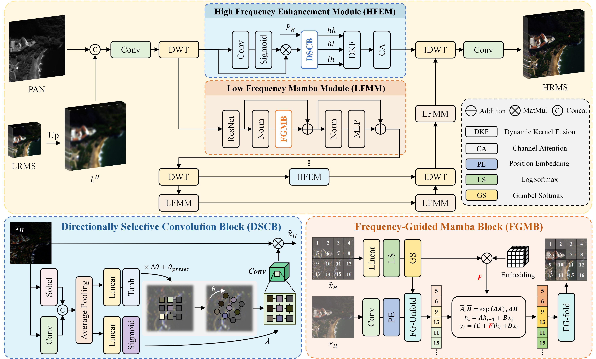

# [TGRS 2026] Frequency-Driven State Space Model for Remote Sensing Pansharpening

🔥 PyTorch codes for "[Frequency-Driven State Space Model for Remote Sensing Pansharpening]()", **IEEE Transactions on Geoscience and Remote Sensing**, 2026.

- Authors: Xiaochen Zhang, Jiangyun Li, Hao Wang, and Peixian Zhuang

## 🖼️ Method Overview

<div align=center>

</div>

## 📁 Project Structure

```
FDMamba/
├── main.py             # Training entry point
├── option.yml          # Configuration file
├── get_matlab.py       # MATLAB format result export for testing
├── model/
│   ├── fdmamba.py      # Main network architecture
│   └── base_net.py     # Base network components
├── solver/
│   ├── solver.py       # Training solver
│   └── basesolver.py   # Base solver class
├── utils/
│   ├── SAM_loss.py     # Spectral Angle Mapper loss
│   ├── loss_util.py    # SSIM, FFTLoss, D_lambda loss
│   └── lr_scheduler.py # Learning rate scheduler
├── vis/                # Visualization tools (error maps, HQNR assessment)
├── MetricCode/         # MATLAB testing code for metrics (PSNR, SSIM, SAM, etc.)
├── checkpoint/         # Trained model checkpoints
├── 2_DL_Result/        # Quantitative results and MATLAB outputs
└── dataset/            # Training/test datasets
```
## 📦 Data Preparations
Datasets are from [PanCollection](https://github.com/liangjiandeng/PanCollection).

```
dataset/
├── train_gf2.h5
├── train_qb.h5
├── train_wv3.h5
├── test_gf2_multiExm1.h5
├── test_gf2_OrigScale_multiExm1.h5
├── test_qb_multiExm1.h5
├── test_qb_OrigScale_multiExm1.h5
├── test_wv3_multiExm1.h5
└── test_wv3_OrigScale_multiExm1.h5
```
## 🚀 Get Started
### Your Model Name

- `name`: The model name (e.g., `Net`)
- `algorithm`: The algorithm for training (e.g., `fdmamba`)

### Logging
- `log_dir`: Location to store log files (default: `log/`)

### Model Weights
- `checkpoint`: Location to store model weights (default: `checkpoint/`)

### Training Data
- `data.base_path`: Base path of the training data
- `data.data_name`: Dataset name (`wv3`, `qb`, `gf2`)
- `data.batch_size`: Batch size
- `data.patch_size`: Training patch size

### Training
```bash
python main.py
```

### Testing
```bash
python get_matlab.py
```

Results are saved in `.mat` format to `2_DL_Result/`. For evaluation metrics (PSNR, SSIM, SAM, etc.), run `MetricCode/` in MATLAB on Windows.

## 📈 Visualization

The `vis/` directory provides visualization tools:

- **`hqnr_generate.py`**: Generate HQNR assessment scores
- **`err_generate.py`**: Generate error maps between GT and output images

## 📥 Pre-trained Checkpoints

Pre-trained model weights are available for download: [Google Drive](https://drive.google.com/drive/folders/1UtoJadPZvXt91U6U91y9Trjl7xaJk8Mz?usp=drive_link)

## 🏆 Benchmark Results

Comprehensive benchmark results on standard datasets: [Google Drive](https://drive.google.com/drive/folders/1hrRCUk2TOgn8JsqZNZ0WRb936u_1QTSO?usp=sharing)

Comparison methods: MTF_GLP_FS, BDSD_PC, TV, PNN, PanNet, DiCNN, MSDCNN, FusionNet, U2Net, CANNet, PanMamba, Ramsf, Premix, ADWM

## 🥰 Citation

**If you find our repository useful, please consider giving it a star ⭐ and citing our research papers in your work.**

```
@article{zhang2026frequency,
  title={Frequency-Driven State Space Model for Remote Sensing Pansharpening},
  author={Zhang, Xiaochen and Li, Jiangyun and Wang, Hao and Zhuang, Peixian},
  journal={IEEE Transactions on Geoscience and Remote Sensing},
  year={2026}
}

@article{li2026rethinking,
  title={Rethinking Pansharpening via Correspondence-Aware Complementary Fusion},
  author={Li, Jiangyun and Zhang, Xiaochen and Gu, Tong and Wang, Hao and Du, Hao and Zhuang, Peixian},
  journal={IEEE Journal of Selected Topics in Applied Earth Observations and Remote Sensing},
  year={2026},
  publisher={IEEE}
}
```
